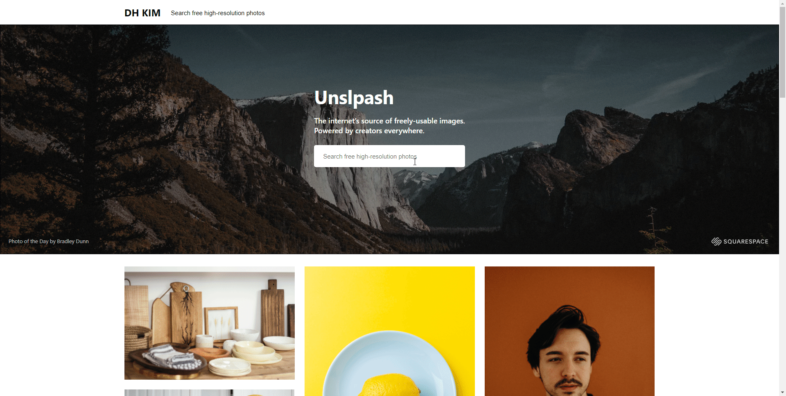
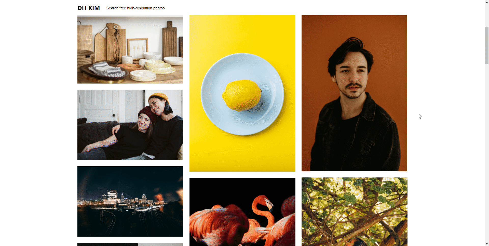

# **Unsplash Clone** 

This is a clone project of [**Unsplash**](https://unsplash.com) made with ReactJS and Typescript.

Unfortunately, as [**unsplash demo api**](https://unsplash.com/oauth/applications) restricts the number of requests per hour, i decided not to deploy demo of this clone.

If you want to watch video click [**here**](https://www.linkedin.com/feed/update/urn:li:activity:6756093010494267392/)

 

## Index

[1. Why did i make](#Why-did-i-make)  
[3. Developement stack](#Developement-stack)  
[4. Detail](#Detail)  
[5. What did i learn](#What-did-i-learn)

 

### **Why did i make**

- To improve reactjs skills
- To learn how to use typescript with reactjs
- To get familiar with using API

 

### **Developement stack**

 

 
 

### **Detail**

#### **Main page**

- `Shows latest images of unsplash (infinite scrolling)`

 

#### **search images**

- `By entering keyword, you can see images that you want`

 

#### **Photographer information**

- `By hovering mouse on specific image, you can see photographer's information`

 

#### **download image**

- `You Can download any image by clicking size of image`

 

#### **Related photos and Collections**

- `Also related photos and collections are avaliable`

### **What did i learn**

`1. learned importance global state management`

As i made lots of small components to make every single component as simple as possible, sometimes, i needed to pass down the props sevaral times to use it in descendent component.   
I felt i need to learn how to manage global state using context API or redux.

`2. learned necessity of optimization`

Honestly, before i made this clone, i didn't realize how important optimization is in react application. I just thought that since reactjs is super fast, i don't even need to think about optimization. However, As i sent lots of API requests, i felt it is getting slower.
So i thought that i need to learn more about how to optimize react app by using useCallback, useMemo, Memo, etc...
