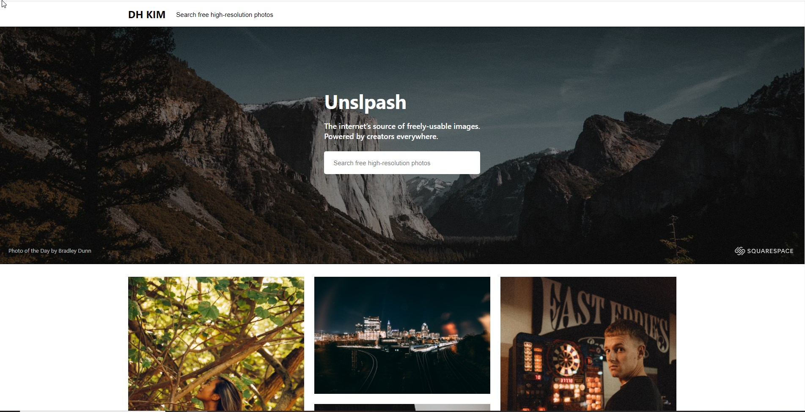

# Unsplash Clone with ReactJS & Typescript

Built unsplash clone using ReactJS and Typescript.

This project is clone project of [**unsplash.com**](https://unsplash.com/).
If you want to use unsplash API click [**here**](https://unsplash.com/oauth/applications)

---

### **`Live Demo`**

As unsplash demo API has restricted number of requests, i decided not to deploy this clone. Instead, there's some previews below.

## **Thumbnail**

---

### **`What You can see in this project`**

## **1. Search**

## **2. Photographer info**

## **3. Infinite scrolling**

## **4. Image download**

## **5. Related photos and Collections**

## **6. Responsive Design**

